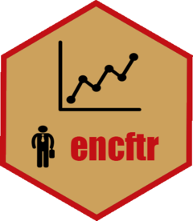

<!-- README.md is generated from README.Rmd. Please edit that file -->

# encftr 

<!-- badges: start -->

[](https://www.repostatus.org/#wip)
[](https://www.tidyverse.org/lifecycle/#experimental)
[](https://github.com/endomer/encftr/actions)
[](https://codecov.io/gh/endomer/encftr?branch=master)
[](https://CRAN.R-project.org/package=encftr)
<!-- badges: end -->

`encftr` es una interfaz para trabajar con la base de datos de la
Encuesta Nacional Continua de Fuerza de Trabajo (ENCFT) en R. Esta
paquete es parte de [endomer](https://endomer.github.io/) un proyecto de
código abierto que busca ofrecer interfaces en R para las principales
encuestas de la República Dominicana.

## Instalación

`encftr` aun no está en CRAN.

<!-- You can install the released version of encftr from [CRAN](https://CRAN.R-project.org) with: -->
<!-- ``` r -->
<!-- install.packages("encftr") -->
<!-- ``` -->

Pero puedes intalar la versión de desarrollo desde
[GitHub](https://github.com/) con:

``` r
tryCatch(
  library(remotes),
  error = function(e){
    install.packages('remotes')
  }
)
remotes::install_github("endomer/encftr")
```

## Roadmap

1.  Completar el diccionario.

<!--html_preserve-->

<div style="display:inline-block;
             vertical-align:baseline;
             width:100%;
             height:20px;
             margin-bottom:20px;
             overflow:hidden;
             background-color:#f5f5f5;
             border-radius:4px;
             -webkit-box-shadow:inset 0 1px 2px rgba(0,0,0,.1);
             box-shadow:inset 0 1px 2px rgba(0,0,0,.1);">

<div style="float: left;
height: 100%;
font-size: 16px;
line-height: 20px;
color: #fff;
text-align: center;
box-shadow: inset 0 -1px 0 rgb(0 0 0 / 15%);
transition: width .6s ease;
background-color: #d9534f;  width: 5.8%;">

5.8%

</div>

</div>

<!--/html_preserve-->

2.  Agregar una función para calcular la pobreza monetaria.
3.  Agregar una función para el cálculo del ICV.
4.  Agregar validadores a las funciones para garantizar que las
    variables son del tipo y con el contenido esperado en los cálculos.
5.  Escribir tests
6.  Hacer que todas las funciones trabajen con conexiones a base de
    datos (Las que usan cut3 específicamente).

## Contribuye

Tienes comentarios o quieres contribuir?

Por favor, revisa las [gias de contribución (en
inglés)](https://endomer.github.io/encftr/CONTRIBUTING.html).

Ten en cuenta que el proyecto `encftr` está sujeto a un [Código del
contribuyente](https://contributor-covenant.org/es/version/2/0/CODE_OF_CONDUCT.html).
Contribuyendo con el proyecto aceptas los términos y condiciones.

<hr/>
<!--html_preserve-->

<a href="./articles/encftr.html"><button type="button"
style = "
    border: 1px solid transparent;
    background-color: #00a65a;
    display: block;
    padding: 10px 16px;
    font-size: 18px;
    line-height: 1.3333333;
    color: #fff;
    cursor: pointer;
    margin-left: 35%;
    margin-top: 10px;
    font-weight: 900;
    text-align: center;
    white-space: nowrap;
    vertical-align: middle;"> Guía de inicio
rápido</button></a><!--/html_preserve-->
